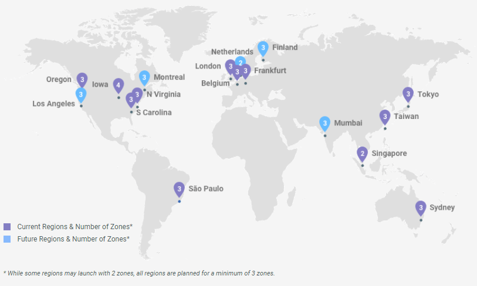

# Zonas y Regiones en Google Cloud Platform (GCP)

En **Google Cloud Platform (GCP)**, las **regiones** y **zonas** permiten distribuir los recursos de infraestructura para lograr **alta disponibilidad**, **tolerancia a fallos** y **baja latencia**.

---

## ¿Qué es una Región en GCP?

Una **región** es una **ubicación geográfica específica** donde Google tiene centros de datos.

Ejemplos de regiones en GCP:
- `us-central1` (Estados Unidos)
- `southamerica-west1` (Chile)
- `europe-west1` (Bélgica)

### Características:
- Contiene varias zonas
- Permite cumplir requisitos de latencia y residencia de datos
- Es independiente de otras regiones

---

## ¿Qué es una Zona en GCP?

Una **zona** es una **parte aislada dentro de una región**.

Ejemplos:
- `us-central1-a`
- `us-central1-b`
- `us-central1-c`

### Características:
- Cada zona corresponde a uno o más centros de datos
- Tiene energía, red y refrigeración independientes
- Reduce el impacto de fallos físicos

---

## Relación entre Región y Zonas

Una región contiene múltiples zonas:

---

## Alta Disponibilidad en GCP

Al distribuir recursos en varias zonas:
- Si una zona falla, las otras continúan operando
- Se evita un único punto de fallo
- Se mejora la confiabilidad del sistema

Ejemplo:
- VM en `us-central1-a`
- VM en `us-central1-b`
- Balanceador de carga distribuyendo tráfico

---

## Buenas Prácticas en GCP

- Usar **múltiples zonas** para producción
- Elegir la **región más cercana** a los usuarios
- Separar ambientes (dev, test, prod)
- Usar balanceadores de carga regionales

---

## Resumen

- **Región**: ubicación geográfica
- **Zona**: centro de datos aislado dentro de una región
- GCP recomienda arquitecturas **multi-zona**
- Mejora disponibilidad y tolerancia a fallos
